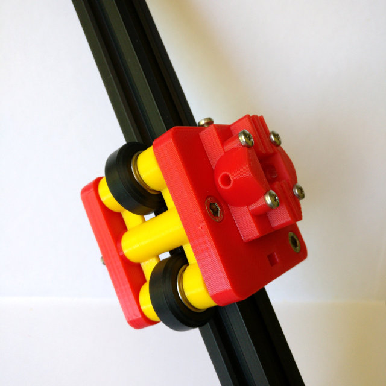

# Kossel Leaf

Kossel Leaf is a carriage system for Kossel-style delta robot 3D printers.

It uses 3D printed components, OpenBuilds-style V-wheels, OpenBuilds-style 20mm V-slot aluminium extrusions, and standard metric fasteners.

The carriage is designed to drop in place of an existing Hiwin-style MGN12H (or MGN12C) rail system, only increasing the printer’s `DELTA_RADIUS` by 0.05mm.

Kossel Leaf uses a 3D printed leaf spring to keep two wheels under tension and pressed against the extrusion firmly and evenly at all points along vertical travel, like a [SeeMeCNC Cheapskate carriage](https://www.seemecnc.com/products/injection-molded-cheapskate-carriage-set).

See the included instruction manual for full BOM and assembly instructions.

## License

[CERN OHL v1.2](http://ohwr.org/cernohl)

## Author

Jamie Bainbridge - jamie.bainbridge@gmail.com

